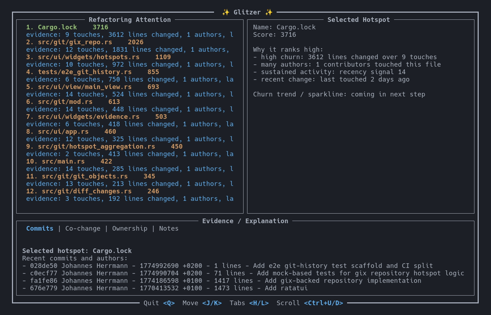

# ✨ Glitzer

> Make your repository shine, one refactor at a time

Glitzer is a Rust TUI that helps you find refactoring hotspots in a Git repository.

It analyzes Git history, ranks files by change-based risk signals, and shows the evidence behind the ranking so you can decide where to look first.

[](https://github.com/JoBuRo/glitzer/actions/workflows/ci.yml)




---

## Why Glitzer?

When a codebase starts to feel hard to change, the problem is rarely spread evenly.

Some files accumulate risk because they:

- change often
- are touched by many different contributors
- keep reappearing in recent work
- frequently change together with other files

Glitzer helps you surface those files quickly and inspect the evidence behind the ranking.

It is useful for:

- **refactoring triage** — decide where cleanup work will pay off first
- **codebase exploration** — understand risky or unstable areas faster
- **technical leadership** — support maintenance decisions with historical signals
- **onboarding** — identify “important but painful” files in an unfamiliar repository

---

## What Glitzer does

Glitzer currently focuses on **Git-history-driven hotspot detection**.

It:

- ranks files by likely maintenance risk based on Git history
- explains why a file is ranked highly
- focuses the default view on actionable files in HEAD
- excludes lockfiles, generated paths, and vendored paths from the default hotspot list
- provides evidence views for validation and interpretation

### Evidence tabs

- **Commits** — recent commits and authors touching the file
- **Co-change** — files that frequently change together
- **Ownership** — contributor distribution for the file
- **Notes** — risk and prioritization guidance

---

## Installation

### Prerequisites

You need [Rust and Cargo](https://www.rust-lang.org).

### Build from source

```bash
git clone https://github.com/JoBuRo/glitzer.git
cd glitzer
cargo build --release
```

### Install locally

```bash
cargo install --path . --locked
```

After installation:

```bash
glitzer
```

---

## Usage

Run Glitzer for the current repository:

```bash
glitzer
```

Run Glitzer for a specific repository:

```bash
glitzer --repo /path/to/repo
```

Add one or more manual blacklist rules (exact file or directory prefix ending in `/`):

```bash
glitzer --exclude Cargo.lock --exclude custom/noise/
```

---

## Keyboard controls

- `j` / `k` — move selected hotspot
- `h` / `l` — switch evidence tabs
- `Ctrl+u` / `Ctrl+d` — scroll evidence up/down
- `q` — quit

---

## How to read the results

Glitzer does **not** claim that a hotspot is automatically “bad code”.

A high-ranking file is better understood as a file that deserves attention because its history suggests elevated maintenance risk or coordination cost.

In practice, hotspots can indicate:

- refactoring candidates
- unstable responsibilities
- coordination bottlenecks
- architectural seams under pressure
- files worth reviewing before larger changes

Use the ranking as a starting point, then inspect the evidence tabs before drawing conclusions.

---

## Current scope and behavior

Glitzer is intentionally focused.

Current behavior:

- analysis is based on **Git history**
- merge traversal follows a **first-parent policy** for deterministic mainline attribution
- rename and move continuity is preserved using **Git rewrite tracking**
- deleted files are excluded from the default hotspot list
- lockfiles, generated paths, and vendored paths are excluded from the default hotspot list
- `--exclude` appends additional blacklist rules (exact file or directory prefix)
- static code complexity is **not** included

This keeps the tool simple and explainable while the hotspot model matures.

---

## Demo


---

## Project status

Glitzer is under active development.

Current priorities are centered on:

- explainability of hotspot scoring
- better user controls for analysis scope
- improved interaction flow in the TUI

Feedback from real repositories is especially useful.

---

## Contributing

Issues and pull requests are welcome.

Please see: `docs/CONTRIBUTING.md`

Good contributions include:

- bug reports with reproducible repository history scenarios
- UX feedback from real repository usage
- documentation improvements
- tests for edge cases in Git history handling
- improvements to hotspot explainability

---

## Development

Build:

```bash
cargo build
```

Run tests:

```bash
cargo test
```

Run against this repository:

```bash
cargo run -- --repo .
```

---

## Roadmap

Near-term areas of work include:

- configurable analysis windows
- score breakdown and weighting transparency
- non-blocking startup and loading/progress state
- improved trend visualization in hotspot details

---

## License

Apache-2.0
